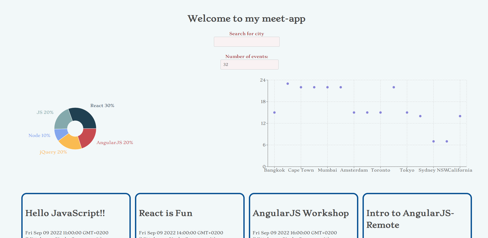

# meet-app

meet-app is an application for users to find events based on their location. It is a serverless progressive web application (PWA) using React and built using the test-driven development (TDD) technique. The app utilises the Google Calendar API.

## Built with

- Javascript
- HTML
- CSS
- React
- Jest, Cucumber and Puppeteer for Testing
- Google Calendar API and OAuth2
- AWS Lambda

The application was created using the Create React App (CRA) boilerplate, enabling the pwa template to transfer the app into a PWA in the development process:

npx create-react-app meet --template cra-template-pwa --use-npm

## Key features

- Filter events by city.
- Show/hide event details.
- Specify number of events.
- Use the app when offline.
- Add an app shortcut to the home screen.
- View a chart showing the number of upcoming events by city.

## User stories and test scenarios

## FEATURE 1: FILTER EVENTS BY CITY

As a user, I should be able to filter events by city so that I can see the list of events that take place in that city.

**Scenario 1: When a user hasn’t searched for a city, show upcoming events from all cities.**

- Given a user hasn't searched for any city
- When the user opens the app
- Then the user should see a list of all upcoming events

**Scenario 2: A user should see a list of suggestions when they search for a city.**

- Given the main page is open
- When the user starts typing in the city textbox
- Then the user should see a list of cities that match what they've typed

**Scenario 3: A user can select a city from the suggested list.**

- Given the user was typing "Hamburg" in the city textbox
- When the user selects a city from the list (e.g., "Hamburg, Germany")
- Then their city should be changed to that city (i.e., "Hamburg, Germany")

## Feature 2: Show and hide event details

As a user, I should be able to show and hide event details so that I can see more or less info about an event based on my preferences.

**Scenario 1: An event element is collapsed by default**

- Given the user is on the main page
- When nothing is selected
- Then the event details will be hidden

**Scenario 2: The user can expand an event to see its details**

- Given the user wants to see more info about an event
- When the user clicks on that event
- Then the hidden info for that event will be expanded

**Scenario 3: The user can collapse an event to hide its details**

- Given the user has seen the details and chooses to collapse the view
- When the user clicks on the expand view
- Then the view should collapse

## Feature 3: Specify the number of events

As a user, I should be able to specify the number of events I want to view so that I can see more or fewer events in the events list at once.

**Scenario 1: When the user hasn’t specified a number, 32 is the default**

- Given the user has no preference
- When the user visits the page
- Then a default of 32 events is displayed

**Scenario 2: The User has specified a count preference**

- Given the user had specified the number of events to be displayed
- When the user visits the page
- Then the specified count of events will display

## Feature 4: Use the app when offline

As a user, I should be able to use the app when offline so that I can see the events I viewed the last time I was online.

**Scenario 1: Show cached data when there’s no internet connection**

- Given the user has no internet connection
- When the user opens the app
- Then the data will be accessible to the user

**Scenario 2: Show error when the user changes the settings (city, time range)**

- Given the user has no internet connection
- When the user wants to alter info
- Then an error message will be displayed

## Feature 5: Data visualisation

As a user, I should be able to see a chart showing the upcoming events in each city so that I know what events are organised.

**Scenario 1: Show a chart with the number of upcoming events in each city**

- Given the user is on the main page
- When the user wants to see upcoming events
- Then the user will see a chart containing upcoming events

## Running the project

- Clone or download repository

  git clone https://github.com/Junior-22/meet-app

- To run app on localhost:

  npm run start

- To push changes to GitHub pages
  
  npm run deploy

[Visit the site](https://junior-22.github.io/meet-app/)